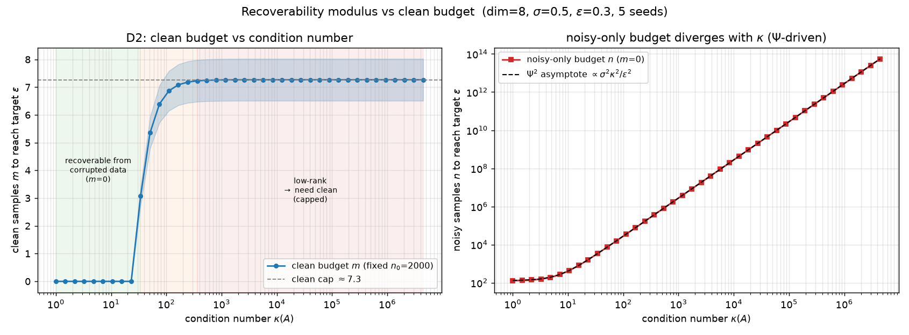

# Recoverability Modulus `Ψ_{T_r}`

A continuous **recoverability modulus** that unifies two facts about learning a clean
distribution from corrupted samples:

- **SFBD-OMNI** (Lu, Yu, Lo) treats recoverability as *binary*: the corruption operator
  `T_r` is injective ⟹ the clean distribution is identifiable. But OMNI itself notes
  *"Identifiability ≠ Recoverability"* — injectivity guarantees recovery only with access to
  the true corrupted density; finite-sample error is amplified through `T_r^{-1}`.
- **SFBD** (Lu, Wu, Yu) shows Gaussian noise is injective yet effectively unrecoverable
  (an `O((log n)^{-2})` rate) — *single, but not recoverable*.

This repo turns that "is/isn't" into a **continuous scale**: the recoverability modulus

```
Ψ_{T_r}(φ) = inf{ ‖ψ‖ : T_r* ψ = φ },
```

the **source / Picard condition** of the corruption's adjoint `T_r*`. It quantifies how hard a
clean-space test function `φ` is to see through the corruption, and predicts the clean-sample
budget needed to recover the clean distribution.

> **Honest scope.** Everything here is a **Gaussian–linear toy** (closed-form, CPU-only). `Ψ` is
> essentially a classical inverse-problem *source condition*; the contribution is the *synthesis*
> (unifying SFBD's rate and OMNI's identifiability), a clean-space rate translation, a clean-budget
> decomposition, and a cross-operator empirical law — not new fundamental mathematics. Theorems are
> proof *skeletons* (see caveats below).

---

## Key results

| # | Result | Where |
|---|--------|-------|
| **D1** | `Ψ` exactly recovers SFBD's `exp(σ²‖u‖²/2)` amplification (machine precision; slope = σ²/2). | `results/D1_M1_prop1_recovery.png`, `notes/M1` |
| **D2** | **clean budget vs. condition number**: noisy-sample budget diverges ∝ `Ψ²`; a few clean samples *cap* it. Three phases. | `results/D2_budget_curve.png`, `results/D2_caption.md` |
| **D3** | `Ψ` **predicts the sample budget** vs. Monte-Carlo: slope ≈ 1, R² ≈ 1.0 over 5 orders of magnitude. | `results/D3_sample_complexity_{n,m}.png` |
| **D5** | **cross-operator collapse**: one modulus orders masking / blur / grayscale / Gaussian onto one curve (Spearman ρ ≈ 0.99). | `results/D5_cross_operator_synth.png` |
| **D6** | clean-space weak-metric rate (translates OMNI's Eq. 21), with a provable KL→χ² bridge lemma. | `notes/M4_clean_space_rate.md` |
| **D7** | clean-budget decomposition: recoverable `O(1/√n)` + null-space `O(1/√m)` → OMNI's `h†` as `λ→0`. | `notes/M5_budget_decomposition.md` |
| **D8** | **the actual SFBD-OMNI algorithm** (closed-form Gaussian): `Ψ` controls clean-space convergence — corrupted KL converges for all κ while clean W2 stalls (Identifiability ≠ Recoverability, live in the iterates). | `results/D8_omni_dynamics.png`, `notes/M6` |



---

## Layout

```
src/recmod/
  operators.py   # linear corruption T_r: gaussian / blur / grayscale / masking + SVD + degrade
  modulus.py     # Ψ_I closed form (Picard), empirical proxy, recoverability index
  recover.py     # Gaussian–linear closed-form recovery, per-direction precision, sample budgets
  budget.py      # Ψ-driven budget prediction
  theory.py      # KL→χ² bridge constant (M4 lemma)
  omni.py        # closed-form SFBD-OMNI alternating minimization (the actual algorithm)
experiments/     # e1..e5 reproduce D1, D2, D3, D5, D8
tests/           # pytest (40 tests)
notes/           # derivations: M1 (Prop-1 recovery), M3 (Picard), M4 (rate), M5 (decomposition), M6 (OMNI dynamics)
results/         # figures + captions
```

## Reproduce

```bash
python -m pip install -r requirements.txt
python -m pytest -q                          # 36 tests
python experiments/e1_verify_psi.py          # D1
python experiments/e2_budget_curve.py        # D2 (main figure)
python experiments/e3_sample_complexity.py   # D3
python experiments/e4_cross_operator.py      # D5
python experiments/e5_omni_dynamics.py       # D8 (the actual OMNI algorithm)
```

## Caveats / open questions

- **Gaussian–linear toy only.** A general (non-additive) `T_r` modulus is not attempted here.
- **Theorems are skeletons.** `range(T_r*)` closedness / inf attainment are assumed; the clean-space
  rate (D6) needs a **bounded-density-ratio** assumption to bridge OMNI's `KL(q‖·)` to the χ² the
  inequality uses (the bridge lemma is proved & numerically checked, but the assumption is strong).
- **Two moduli.** Experiments use the unweighted `Ψ_I` (clean Picard closed form); the rate theory
  uses a `q`-weighted `Ψ_q`. Their exact relation is open.
- **No full literature search yet** to separate what is genuinely new from inverse-problem folklore.

## References

- SFBD — Lu, Wu, Yu, *ICML 2025*.
- SFBD-OMNI — Lu, Yu, Lo, *ICLR 2026*.
- SFBD-Flow — Lu, Lo, Yu, *AISTATS 2026*.
- Inverse-problem regularization / source condition — Engl, Hanke, Neubauer.
- Deconvolution rates — Fan (1991); Meister (2009).
</content>
